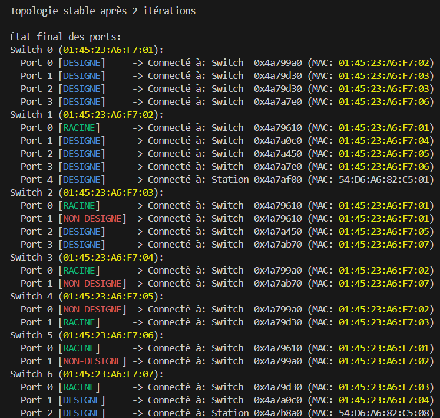
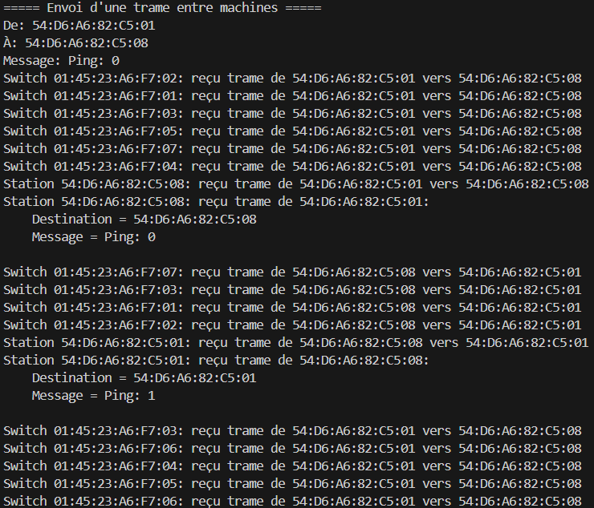
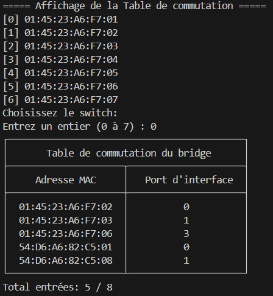

# SAE Simulation Réseau

Projet de fin de 1ère année de **BUT Informatique** à l’**IUT d’Illkirch**.

Le but de ce projet était de simuler un **réseau informatique LAN**.
Le simulateur permet de connecter plusieurs machines entre elles grâce au protocole STP à partir d'un fichier de configuration et d'envoyer des trames grâce au protocole Ethernet.


## Captures d'écran

### Simulation protocole STP


### Envoi de trames


### Table de commutation



## Technologies utilisées

- **Langage :** C#  
- **IDE :** Visual Studio Code 


## Équipe

- Nombre de développeurs : **2**  
- Durée du projet : **7 semaines**


## Installation et exécution

1. Cloner le dépôt :
    ```bash
    git clone https://github.com/MiaouZart/Simulateur-de-Reseau-C.git
    cd Simulateur-de-Reseau/code
2. Lancer le simulateur dans le terminal :
   Méthode 1 :
   ```bash
   ./bin/code <fichier>
   ````
   Exemple : ./bin/code mylan.lan
   Méthode 2 :
   ````bash
   make run fichier=<fichier>
   ````
   Exemple : make run fichier=mylan.lan


## Fonctionnalités principales

- Connecter les machines et les switchs entre eux en fonction d'un fichier de configuration
- Simuler le protocole STP
- Envoyer des trames
- Afficher la table de commutation des switchs
